# 0.0 Team information
| Name | Student Number | Email address |
| ----- | ----- | ----- |
|Jerry Chen | 1006944899 | jianuojerry.chen@mail.utoronto.ca|
|Muchen Liu|1006732145 | muchen.liu@mail.utoronto.ca |
|Spiro Li | 1012635427| supeng.li@mail.utoronto.ca|
|Weijie Zhu|1009310906 | weijie.zhu@mail.utoronto.ca |

# 1.0 Motivation

At the University of Toronto, information about workshops, career fairs, networking sessions, and other campus activities is scattered across multiple platforms. This fragmented communication makes it difficult for students to stay informed and often leads to missed opportunities. Existing channels such as Quercus announcements and social media pages remain limited or inconsistent, offering no unified way to explore events across campus.

To address this gap, the team proposes **University Connection (UniConn)**—a **centralized, cloud-based platform** that consolidates all UofT-related events into a single, accessible interface. UniConn serves two primary user groups: **students**, who gain an organized and interactive way to browse and engage with events, and **event organizers**, who receive streamlined tools to publish events, reach audiences, and view registration insights. This dual-role design fosters clearer communication and strengthens connections between students and campus organizations.

By centralizing event data, UniConn enhances communication efficiency, accessibility, and community engagement. The platform also demonstrates modern cloud-native engineering, featuring a **Node.js + Express.js** backend, a lightweight **HTML** frontend, and **PostgreSQL** persistent storage. Local development uses **Docker Compose**, while cloud deployment relies on **Docker Swarm** to ensure reliability, scalability, and long-term maintainability.

# 2.0 Objective

UniConn focuses on unifying event information, enabling real-time collaboration, maintaining data integrity under load, scaling via cloud-native deployment, and staying observable through built-in monitoring. 

## Centralized Event Aggregation

UniConn’s primary objective is to **centralize all campus event information**. Instead of checking multiple platforms, students can access all kinds of university events in one place. This reduces confusion, improves visibility, and ensures opportunities are not missed due to fragmented information.The platform is designed to **serve both students and organizers with tailored experiences**.

## Collaborative Engagement and Real-Time Insights

UniConn aims to promote **live engagement and community interaction** around campus activities. Real-time chat, interest indicators, and instant updates make the platform feel active and social, helping students connect with peers who share similar interests and stay engaged with ongoing events.

## Reliable State Management and Data Integrity

UniConn ensures the system remains **stable, responsive, and fault-tolerant** during high-traffic periods. The implementation supports concurrent users, preserves critical data (accounts, events, RSVPs, comments), and minimizes disruption during updates or migrations.

## Cloud-Native Deployment and Scalability

Ensure UniConn can **scale smoothly and stay available**. Containerized services, orchestration, and load balancing let us absorb traffic peaks without downtime, while durable storage preserves event and user data through restarts and upgrades. Secret-managed credentials keep growth secure. The goal is a responsive, resilient platform as adoption increases.

## Observability and System Reliability

UniConn deploys monitoring platforms provides **clear visibility into performance and system health**. By exposing metrics, tracking resource usage, and offering health checks, UniConn enables administrators to detect issues early and maintain a high-quality, continuously improving service.

# 3.0 Technical Stack

## 3.1 Technical stack summary
UniConn is built using modern, cloud-native technologies designed for scalability, reliability, and maintainability.

| **Category** | **Technology** | **Purpose / Description** |
|--------------|----------------|----------------------------|
| **Backend** | **Node.js + Express.js** | Provides a lightweight RESTful API for event management, authentication, and real-time features. |
| | **Socket.io** | Enables real-time bidirectional communication for live updates, event chat, comments, and RSVP broadcasts. |
| | **PostgreSQL 16** | Stores events, users, RSVPs, comments, and authentication data persistently on a mounted volume in Swarm. |
| | **JWT + bcrypt** | Secures authentication and role-based access; JWT for sessions, bcrypt for password hashing. |
| | **SendGrid API** | Sends welcome, RSVP confirmation, and organizer event notifications when credentials are provided. |
| **Frontend**| **Static HTML/JS frontend** | Ships with a lightweight dashboard UI for exercising the API and real-time features. |
| **Monitoring & Observability** | **Prometheus + Grafana** | Collects and visualizes metrics on CPU, memory, API latency, request volume, and DB performance. |
| | **Traefik** | Reverse proxy and load balancer with routing and Prometheus metrics support. |
| | **DigitalOcean Monitoring** | Provides infrastructure-level metrics and alerting for Droplet performance. |
| **Containerization & Orchestration** | **Docker + Docker Compose** | Containerizes services for consistent local development and testing. |
| | **Docker Swarm** | Manages production orchestration, service replication, load balancing, and rolling updates. |
| **Security & Configuration** | **Docker Secrets** | Injects database, JWT, and email credentials at runtime without turning them into images. |
| | **Helmet.js** | Adds security headers to protect against web vulnerabilities. |
| | **prom-client** | Exposes application metrics (e.g., request duration, error rates) to Prometheus and shown on Grafana. |

## 3.2 Docker Swarm Runtime Topology

On the Docker Swarm deployment, UniConn is orchestrated across **one** **manager** node and **one** **worker** node. The cluster runs all backend, frontend, and supporting services with defined replica counts and overlay networks, ensuring high availability, service isolation, and reliable real-time communication. The current deployment configuration includes the active services, their replicas, and the associated network topology as summarized below.

- **API service (`api`)**: 3 replicas on **worker nodes**; exposed via Traefik on `traefik-public` with sticky sessions; attached to `uniconn_internal` for database access; health check at `/api/health`.
- **WebSocket entrypoint (`api-ws`)**: 1 replica on **worker nodes** dedicated to `/socket.io`; attached to `traefik-public` and `uniconn_internal`; health check at `/api/health`.
- **Database (`db`)**: 1 replica pinned to the **manager node**; volume `/mnt/volume_uniconn_01/postgresql/data` mounted to `/var/lib/postgresql/data` for persistent storage; credentials via Docker secrets; on `uniconn_internal` only.
- **Prometheus**: 1 replica on the **manager node**; ports `9090:9090`; config from `monitoring/prometheus.yaml`; persistent volume `prometheus-data`; attached to `traefik-public` and `uniconn_internal`.
- **Grafana**: 1 replica on the **manager node**; ports `3000:3000`; persistent volume `grafana-data`; provisioning from `monitoring/grafana/...`; attached to `traefik-public` and `uniconn_internal`.
- **Traefik**: 1 replica on the **manager node**; ports `80:80` and `8080:8080`; attached to `traefik-public`; handles routing/load balancing, security headers, and Prometheus metrics exposure.
- **Networks**:
  - `traefik-public` (external): ingress path for Traefik routing to `api` and `api-ws`.
  - `uniconn_internal` (overlay, attachable): service-to-service network for API ↔ DB and internal traffic.

## 3.3 Monitoring and Alerts metrics

- **Grafana Alerts**: Use Grafana at `http://143.198.39.167:3000` (admin/admin by default) to configure alert rules on key panels—API latency (`http_request_duration_seconds`), request errors (non-2xx rates), CPU/memory/disk from Node Exporter, and Traefik traffic errors. Set email/Slack channels for threshold breaches (e.g., CPU > 70% for 5m, memory > 80% for 5m, high error rate).
- **Prometheus Targets**: All jobs (`uniconn-api`, `traefik`, `node-exporter`, `prometheus`) should be green in `Prometheus > Status > Targets` at `http://143.198.39.167:9090`.
- **Provider Alerts (DigitalOcean)**: Configure DO console alerts for Droplet health: CPU > 70% (5m), memory > 80% (5m), and **Droplet down/unreachable**. These send provider-level notifications if the host or network fails, complementing Grafana rules.

# 4.0 Features

The application provides a complete set of user-facing and platform-level capabilities that meet course requirements and achieve the project goal of **unifying campus events**, **empowering students and organizers**, **supporting real-time interaction**, and delivering a **reliable, observable, and secure service**.

## 4.1 User Features

### 4.1.1 Student Experience

Students explore campus events through a **unified, continuously updated interface**. Real-time updates let students instantly see newly **created, edited, or deleted** events. Discovery is supported through keyword search, category/faculty filters, and date-range filtering. A **one-click registration** system manages attendance, while a personal profile modal provides account details. When SendGrid is enabled, students receive welcome and RSVP confirmation emails.

**Student capabilities:**
- Real-time event browsing and updates  
- Keyword search and advanced filtering  
- Registration and live updates  
- Public comments with self-deletion  
- Welcome and RSVP emails  

### 4.1.2 Organizer Experience

Organizers can **create** events with full metadata and instantly broadcast them. They can **edit or delete** only their own events, ensuring proper access control. An analytics dashboard provides **event counts, registration patterns, attendance trends, and top-performing events**. Organizers can view attendees, moderate comments, and receive event creation/update emails when SendGrid is active.

**Organizer capabilities:**
- Event creation with full metadata  
- Editing and deletion with ownership enforcement  
- Live update broadcasting  
- Analytics dashboard for engagement insights  
- Full attendee visibility  
- Comment moderation  
- Event creation/update emails  

### 4.1.3 Shared API and Interaction Features

All authenticated users share a common API surface using JWT-based authentication. They can browse events, view details, load comments and RSVPs, and receive real-time updates through a shared Socket.IO connection. Users join event rooms, receive broadcasts for event/comment/RSVP changes, and participate in live chat.

These shared interactions ensure a consistent, responsive experience aligned with the objectives of unified access, real-time communication, and transparent engagement.

## 4.2 DevOps Features

UniConn includes operational tools to ensure reliability and observability. A `/api/health` endpoint validates API and database responsiveness, while `/api/metrics` exposes Prometheus-formatted metrics visualized in **Grafana**. **Traefik** provides routing dashboards and logs, and DigitalOcean offers CPU, memory, disk, and network graphs for infrastructure monitoring. Sensitive credentials are managed as secrets, enabling secure rotation without code changes.

# 5.0 User Guide

## 5.1 Getting Started

1. Open UniConn in a modern web browser (Chrome, Edge, or Firefox) using the URL `http://143.198.39.167/`. (You may need to disable auto `HTTPS` redirecting on your browser first.)  
2. The first screen shown is the **Login page**, with options to enter an email and password or to create a new account.  
3. If this is the first visit, click **“Create an Account”** to register; otherwise, log in with an existing account.  

|**Login Page** |**Register Page**|
|--|--|
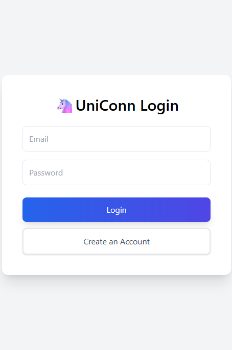|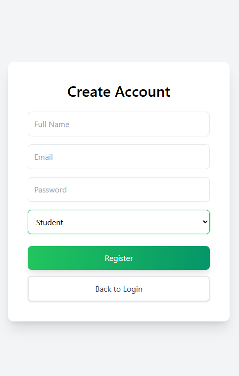|

### 5.1.1 Creating an Account

1. On the **Registration** page, fill in:
   - **Full Name** – the name to be shown on comments, RSVPs, and analytics.  
   - **Email** – used as the login account and for email notifications.  
   - **Password** – a secure password for the account.  
   - **Role** – choose **Student** or **Organizer** depending on how the platform will be used.  
2. Click **“Register”**.  
3. If registration succeeds, UniConn automatically logs in the new user and redirects to the appropriate dashboard. When email is configured, a welcome email is also sent.  
4. If there is a problem (for example, an already registered email), an error message will be shown for specific guidance.  

|**Duplicate Email Detection**            | **Email Comfirmation**|
|--|--|
| 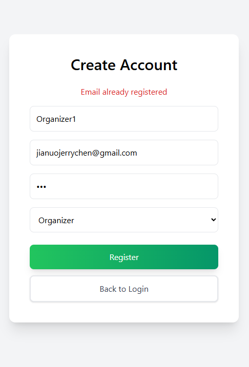|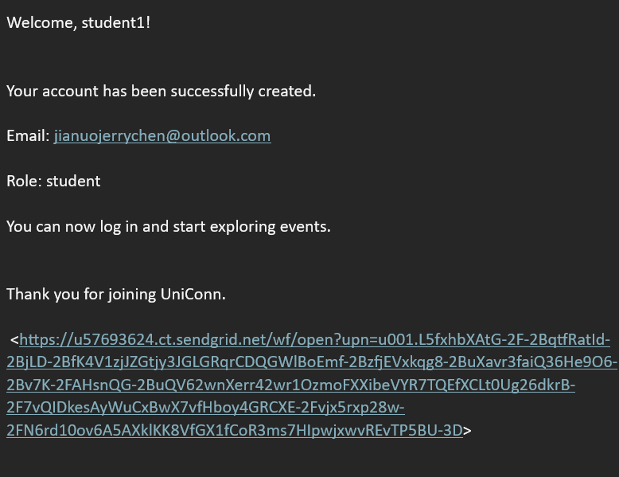|

### 5.1.2 Logging In

1. On the **Login** page, enter the registered email and password.  
2. Click **“Login”**. On success, UniConn opens either the **Student Dashboard** or **Organizer Dashboard** based on the user’s role.  

|**Student Dashboard** |**Organizer Dashboard**|
|--|--|
|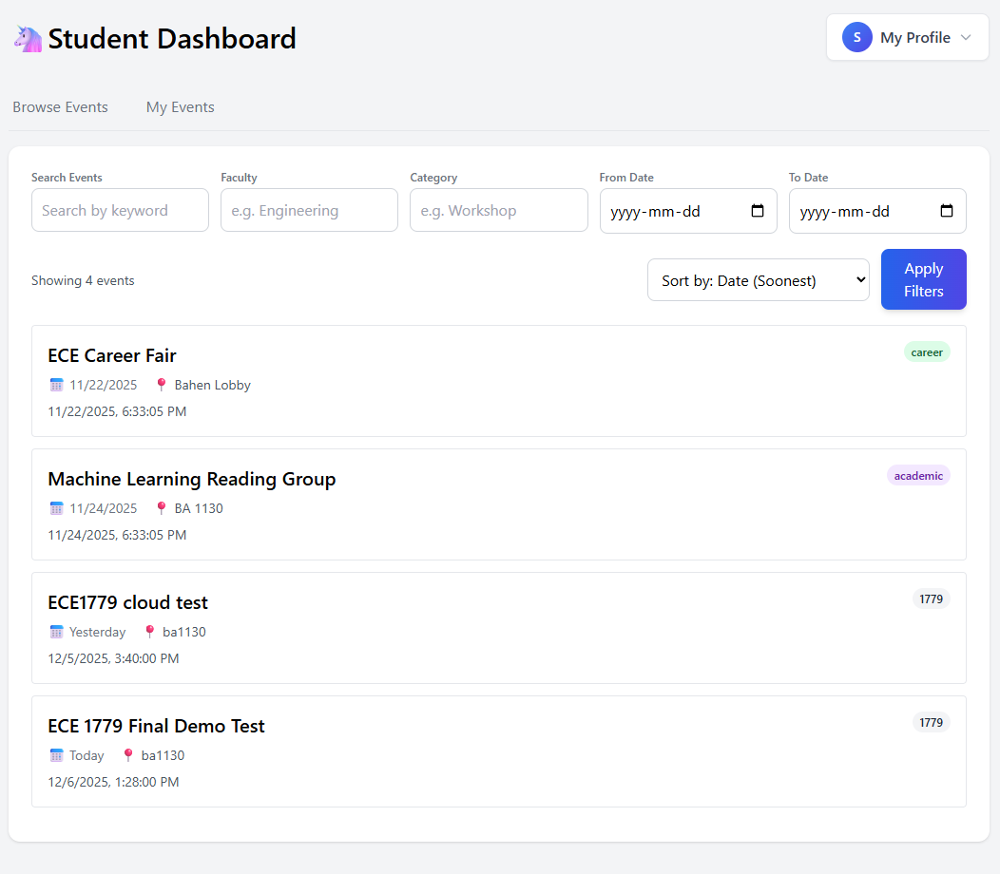 | |

## 5.2 General Guidance

### 5.2.1 Browsing and Filtering Events

1. After logging in, select the **Browse Events** tab.  
2. New events appear automatically as organizers create them, without requiring a page refresh.  
3. Use the **search box** to filter by keywords in the event title or description.  
4. Use the **faculty** and **category** dropdowns to narrow the list to events that match specific academic areas or themes.  
5. Use the **start** and **end date** filters to focus on events happening within a chosen time window.  

|**Browse Events with Filters**|
|--|
|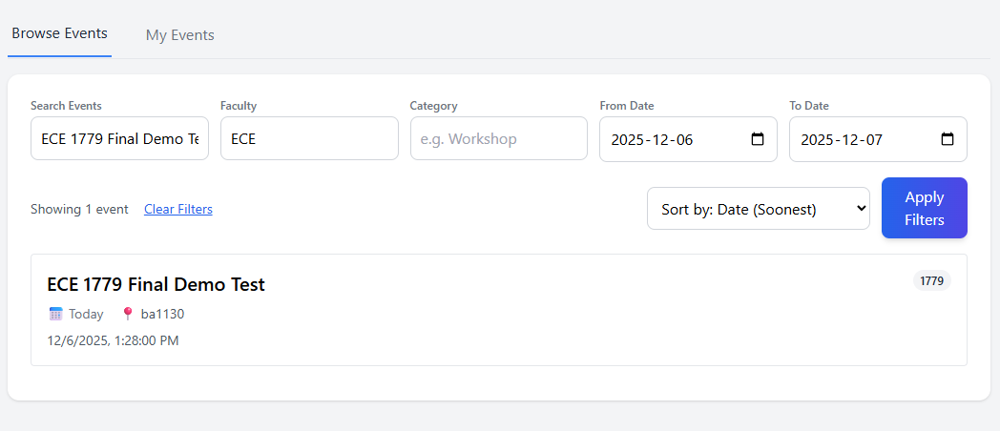|

### 5.2.2 Commenting and Real-Time Discussion

1. Select an event to open its **details and discussion** area.  
2. In the **Comments** section, type a message then submit it.  
3. Newly added comments appear instantly for all connected users viewing that event; comments are stored in the database and load automatically after each login.  
4. All users can **only delete their own comments**.

|**Comments and Discussion**|
|--|
|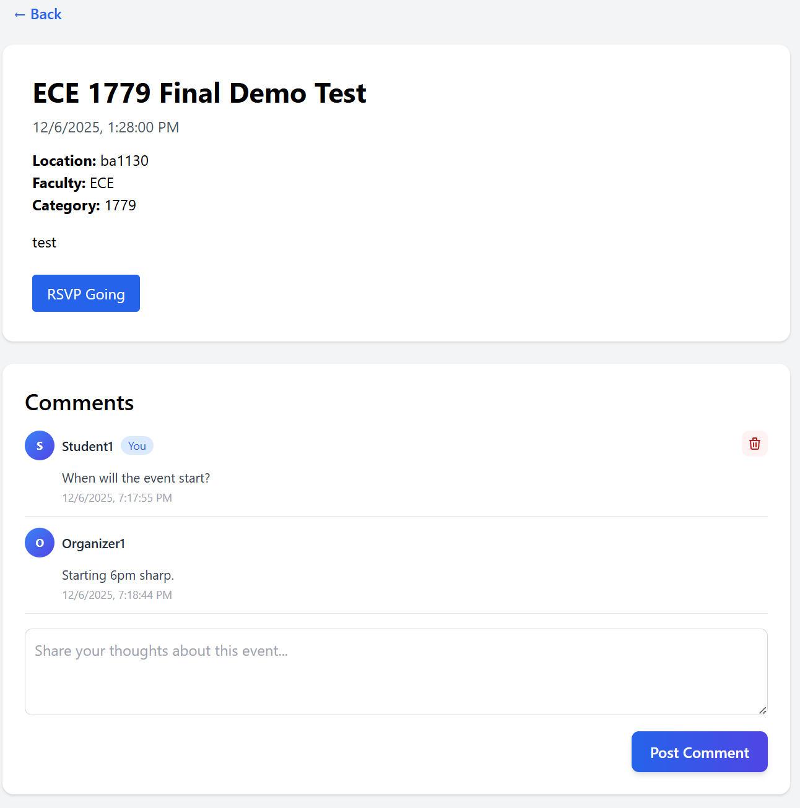|

### 5.2.3 Live Event Chat and Presence

1. For selected events, a **live chat panel** shows messages exchanged in real time.  
2. When the student opens an event, UniConn automatically connects them to the corresponding chat room.  
3. As other users send messages or start typing, the chat panel updates immediately with new content and typing indicators.  
4. A participant counter shows how many users are currently viewing or chatting about the event.  

|**Typing Indicator** |**Leaving Indicator**|
|--|--|
|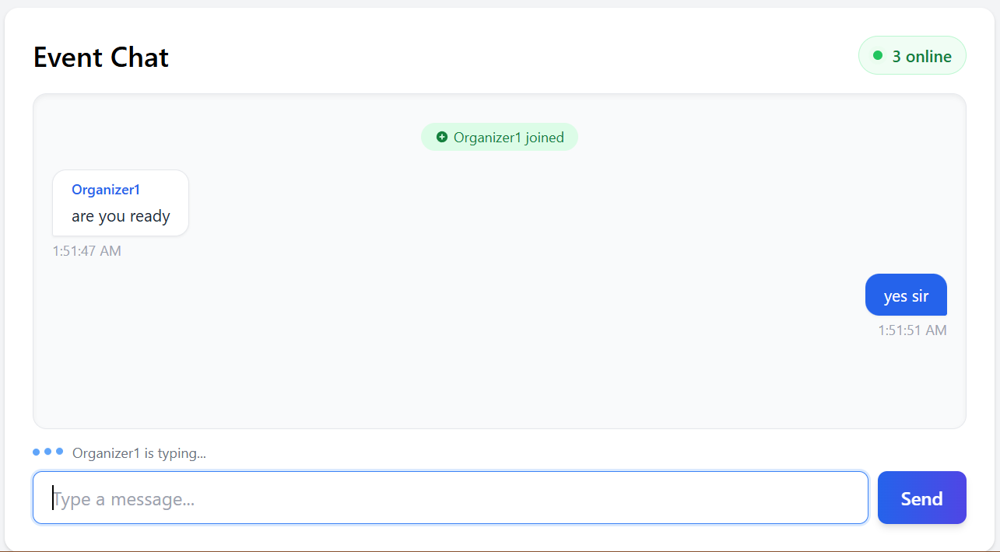 | 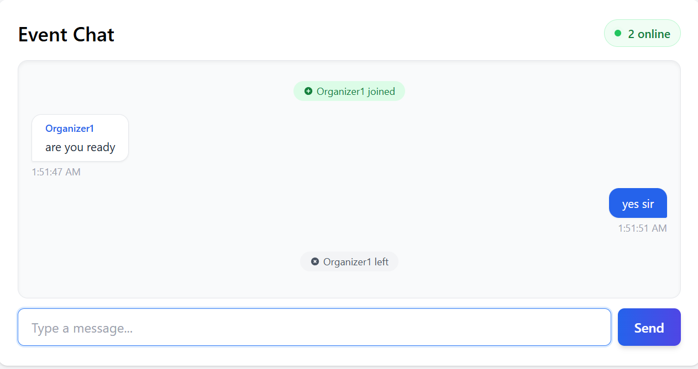|

### 5.2.4 Viewing, Editing Personal Information and Logging Out

1. At the top of the Student Dashboard, click the **Personal Information / My Profile** bar.  
2. A modal opens showing the student’s **name**, **email**, and **role**, along with a **edit** and **Logout** button.  
3. Click on **edit** for editing personal information of the current account or log out when finished using the system.  

|**Personal Info** |**Editing Window**|
|--|--|
|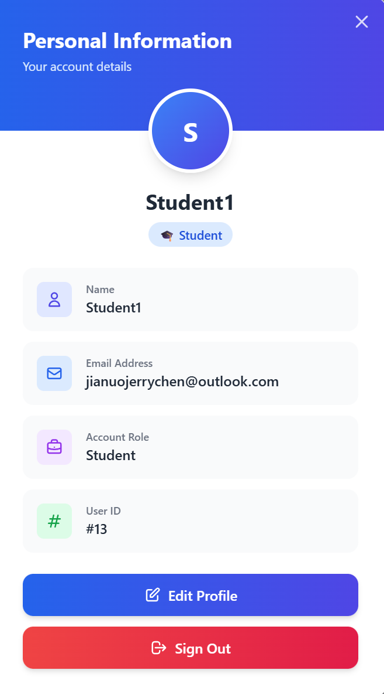 | 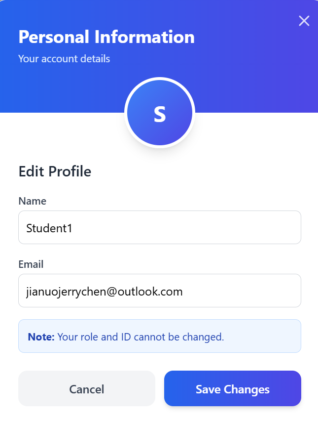|

## 5.3 Student
### 5.3.1 Registering for Events

1. In the **Browse Events** tab, open any event card.  
2. Click the **RSVP Going** icon/button to register.  
3. After a successful registration, a confirmation email is sent (when email notifications are enabled).  

|**Before clicking** |**After clicking**|
|--|--|
|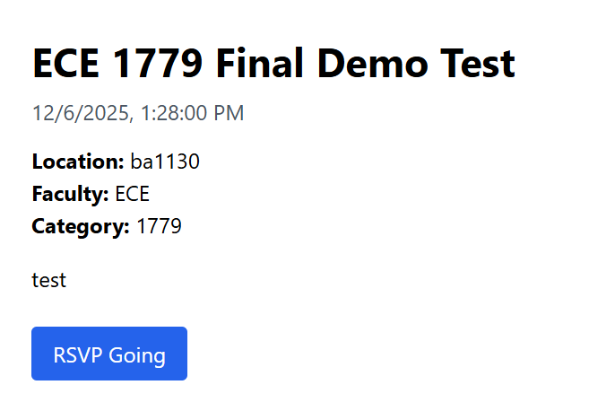 | 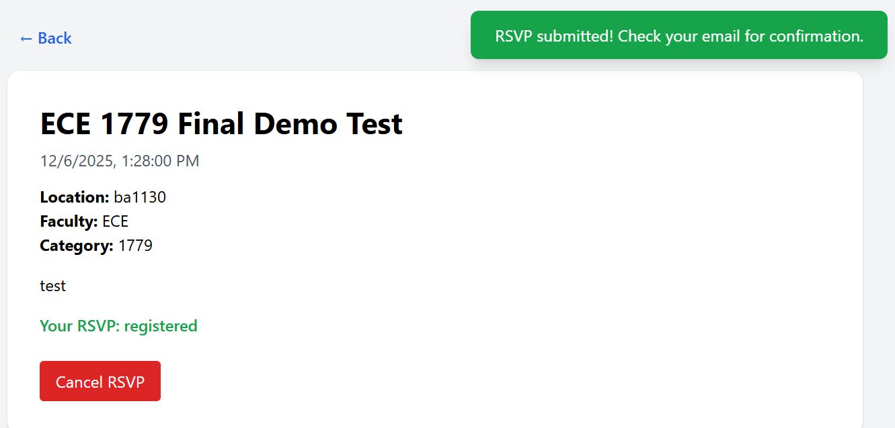|

### 5.3.2 Viewing Registered Events

1. Navigate to the **My Events** tab.  
2. Review the detailed list of all events you have registered for.  
3. Use the list to confirm attendance status or open event details as needed.  

|**My Events (Registered)**|
|--|
|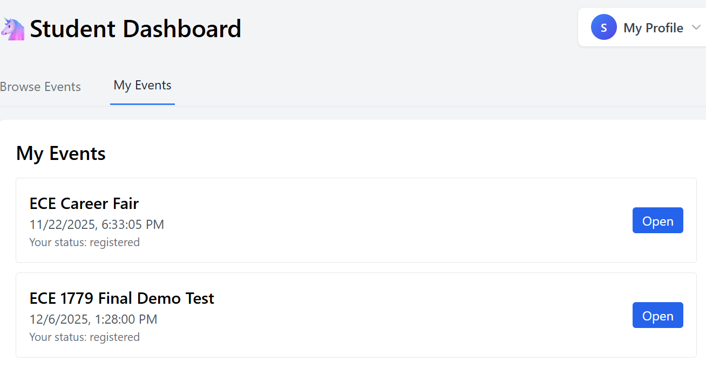|

## 5.4 Organizer Workflow

### 5.4.1 Creating a New Event

1. Log in as an **Organizer** to open the Organizer Dashboard.  
2. Navigate to the **My Events** or **Manage Events** tab (depending on the UI label).  
3. Click the **“Create Event”** button or equivalent control.  
4. Fill in the event form, including:
   - Title and detailed description  
   - Location (room, building, or online link)  
   - Faculty and category  
   - Start date and time, end date and time  
5. Submit the form to publish the event. The event is added to the central event list and becomes immediately visible to students.  

|**Create Event Form**|
|--|
|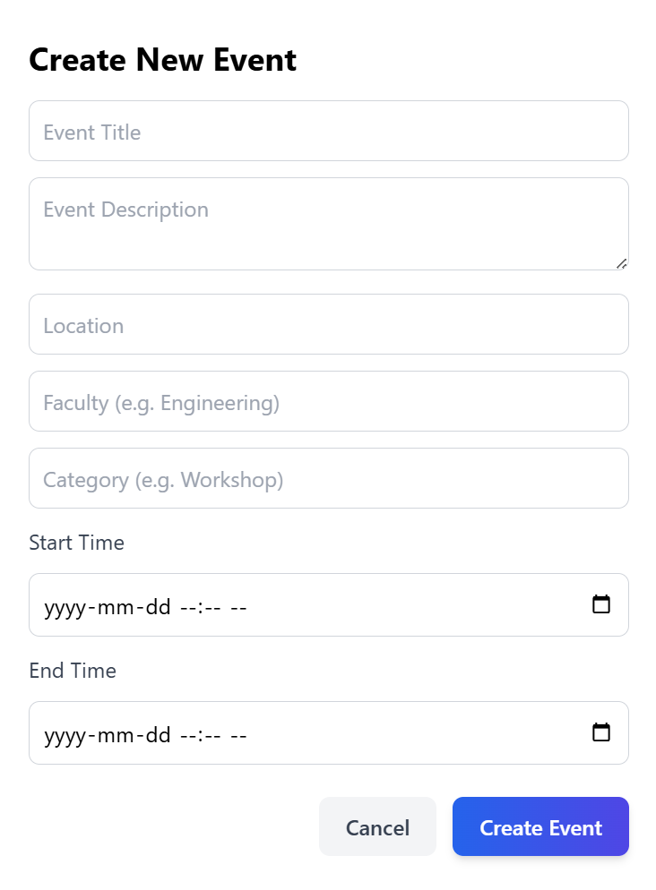|

### 5.4.2 Editing and Deleting Events

1. In the Organizer Dashboard, open the **My Events** list.  
2. Select an event owned by the current organizer.  
3. Choose **Edit** to adjust details such as time, description, or location, then save the changes. All connected clients receive updated information in real time.  
4. Choose **Delete** to remove the event entirely if it is cancelled. Once deleted, the event disappears from the student view and from analytics.  

|**Modify Window** |**Modify result**|
|--|--|
|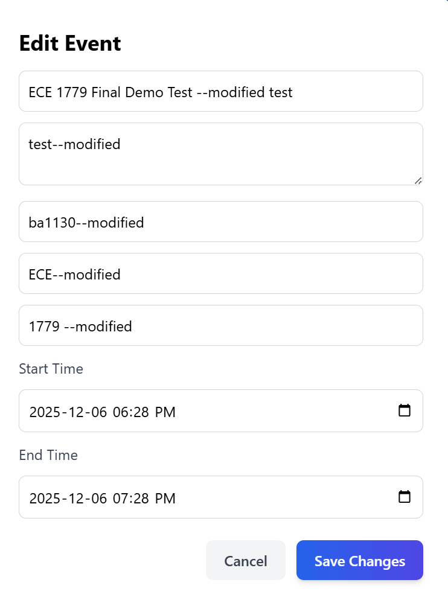 | 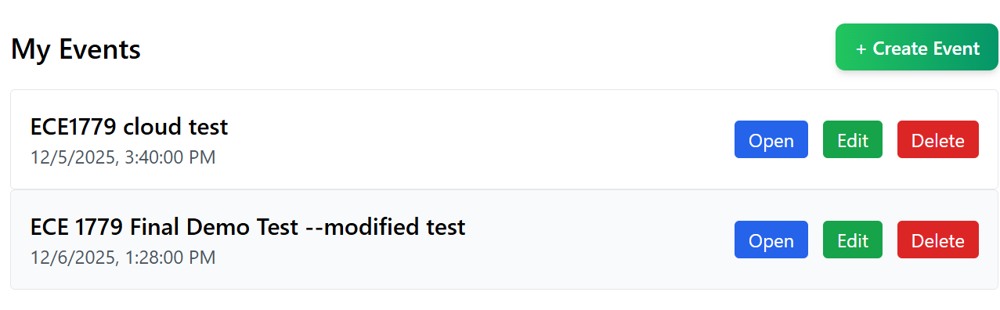|

### 5.4.3 Viewing Registrations and Analytics

1. From the Organizer Dashboard, open the **Analytics** or **Overview** section.  
2. Review key metrics such as:
   - Number of events created by the organizer  
   - Registration counts and distributions across events  
   - Attendance trends and top-performing events  
3. Use this information to refine event timing, topics, or promotion strategies.  

|**Organizer Dashboard Analytics**|
|--|
|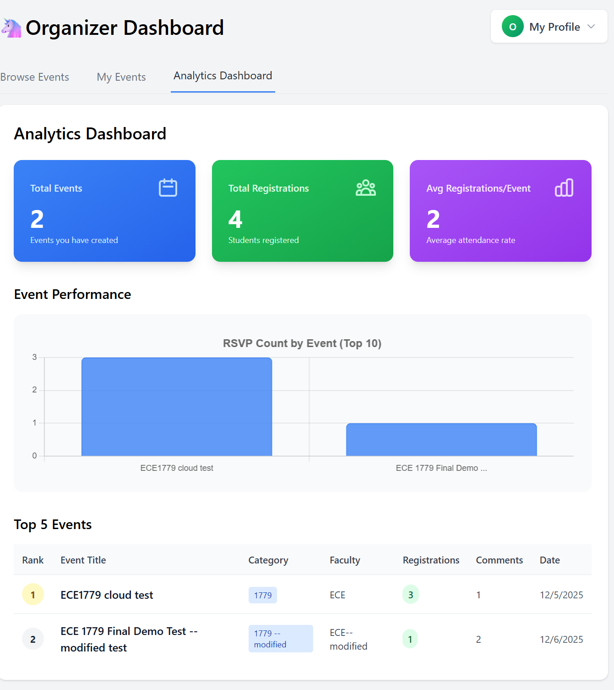| 

# 6.0 Development Guide

This section explains how to set up locally for testing and how to deploy to the DigitalOcean Swarm cluster. Quick path: from the project root run `./localcompose.sh` for local testing and `bash devops/scripts/swarmdeploy/redeploy.sh` for cloud deployment. If either script is not executable on Unix/macOS, run `chmod +x <script>` once.

## 6.1 Local Deployment (`docker compose` Testing)

**Option 1**: One-step local bring-up  
1. Start `docker desktop`
2. Run `./localcompose.sh`.  

**Option 2**: Deploy step by step (Mirrors the script)
1. Ensure Docker Desktop/Engine is running.  
2. Prepare `.env` with local values (API port 8080, DB name/user/password, JWT secret).  
3. Start services: `docker compose -f docker-compose.local.yaml up -d` (schema auto-loads the first time via `/docker-entrypoint-initdb.d/schema.sql`).  
4. If you ever need to re-apply the schema manually:  
   `docker compose -f docker-compose.local.yaml exec -T db psql -U "$POSTGRES_USER" -d "$POSTGRES_DB" -f /docker-entrypoint-initdb.d/schema.sql`  
5. Verify: `docker compose -f docker-compose.local.yaml ps` and `docker compose -f docker-compose.local.yaml logs -f api db`.  
6. Open `http://localhost:8080` to use the app; test APIs via `http://localhost:8080/api/...`.  
7. Stop: `docker compose -f docker-compose.local.yaml down` (add `-v` to reset the DB volume).

## 6.2 Cloud Deployment (`docker swarm` live app)

**Option 1**: One-step cloud redeploy  
1. SSH to the Swarm manager.  
2. Run `bash devops/scripts/swarmdeploy/redeploy.sh`.  

**Option 2**: Deploy step by step (Mirrors the script)
1. Ensure secrets exist: run `devops/scripts/swarmdeploy/create-secrets.sh` if needed (see 6.3).  
2. Confirm the Digital Ocean volume is mounted (e.g., `/mnt/volume_uniconn_01`) and owned by UID 999 for Postgres data.  
3. Deploy Traefik stack: `docker stack deploy -c devops/docker/swarm/traefik.yaml traefik`.  
4. Deploy app stack: `docker stack deploy -c devops/docker/swarm/uniconn.yaml uniconn`.  
5. Deploy monitoring stack: `docker stack deploy -c devops/docker/swarm/monitoring/monitoring-stack.yaml monitoring`.  
6. Verify services: `docker service ls`, `docker service ps uniconn_api`, `docker service logs uniconn_api -f`.  
7. Test endpoints: `http://143.198.39.167/` for the app, `http://143.198.39.167:8080` for Traefik dashboard (if enabled), `http://143.198.39.167:3000` for Grafana.

## 6.3 Environment Variables, Secrets, and First-Time Initialization

- Local `.env`:  
  - `POSTGRES_DB=<db_name>`  
  - `POSTGRES_USER=<psql_user_name>`  
  - `POSTGRES_PASSWORD=<psql_password>`  
  - `JWT_SECRET=<JWT_secret>`  
  - `SENDGRID_API_KEY= <SENDGRID_API_KEY>`  
  - `SENDGRID_FROM_EMAIL<SENDGRID_email>=` 
  - `NODE_ENV=development`  
  These feed both Compose and helper scripts such as `localcompose.sh`.
- Swarm secrets (create once before first deploy): run `devops/scripts/swarmdeploy/create-secrets.sh` on the Swarm manager. It will prompt for `POSTGRES_DB`, `POSTGRES_USER`, `POSTGRES_PASSWORD`, `JWT_SECRET`,  `SENDGRID_API_KEY`, and `SENDGRID_FROM_EMAIL` then create the corresponding Docker secrets (`uniconn_postgres_db`, `uniconn_postgres_user`, `uniconn_postgres_password`, `uniconn_jwt_secret`, `uniconn_sendgrid_api_key`, `uniconn_sendgrid_from_email`).
- First-time database initialization in Swarm: once the `uniconn` stack is up and the `db` service is healthy, apply the schema one time:  
  `docker exec -i $(docker ps -q -f name=uniconn_db) psql -U "$(docker secret inspect --format='{{.Spec.Data}}' uniconn_postgres_user | base64 -d)" -d "$(docker secret inspect --format='{{.Spec.Data}}' uniconn_postgres_db | base64 -d)" < uniconn-backend/db/schema.sql`  
  After the schema is loaded, normal deploys reuse the persisted volume without reapplying the file.

# 7.0 Deployment Information

- **UniConn (live)**: `http://143.198.39.167/`  
- **Grafana dashboard**: `http://143.198.39.167:3000/`
- **Traefik dashboard**: `http://143.198.39.167:8080`

|**Grafana Dashboard**|
|--|
|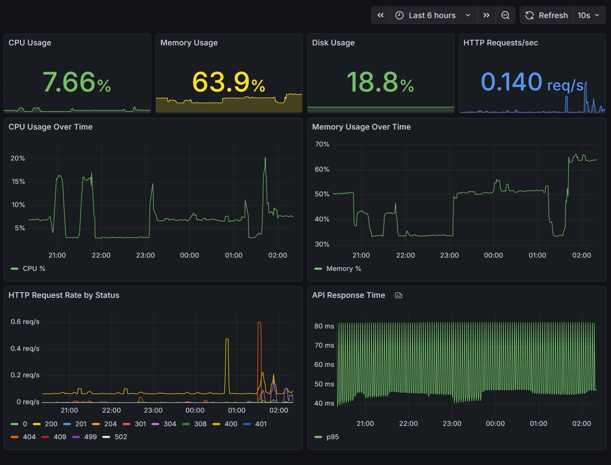| 

|**Traefik Dashboard**|
|--|
|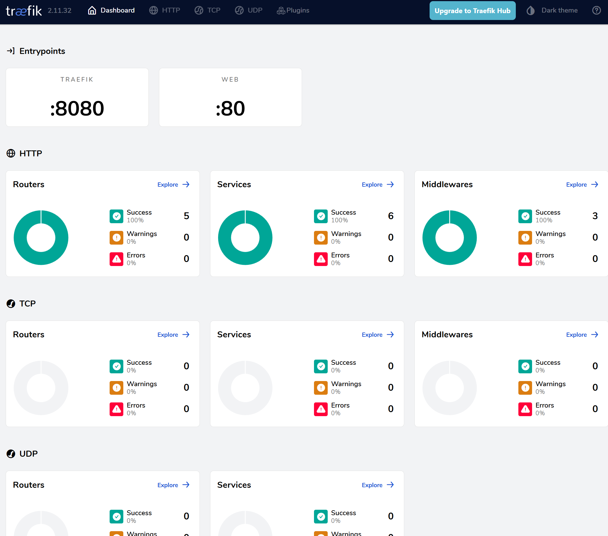| 

# 8.0 Individual Contributions

**Spiro Li**  
Spiro led backend API design and real-time feature development:  
- Authentication System: Implemented JWT-based auth with bcrypt hashing and `/api/auth/register`, `/api/auth/login`, `/api/auth/me` endpoints with role-based access in `routes/auth.js`.  
- SendGrid Email Notifications: Built `notificationService.js` to send automated emails for registrations, event creation/updates, and RSVP confirmations via SendGrid.  
- WebSocket Real-Time Functionality: Developed `websocket.js` with Socket.IO for live event updates, RSVP broadcasts, real-time comments, chat messaging, typing indicators, and room-based participant tracking.  
- REST API Architecture: Structured Express routing with middleware for validation, CORS, and Helmet security headers.  
- Monitoring Dashboard Frontend: Created the monitoring UI (`devops/docker/swarm/monitoring/frontend/`) with modern styling and JS metrics visualization for Prometheus.  
- Technical Documentation: Authored `ADVFEATURE.md` covering implementation and testing of notifications and WebSocket features.

**Weijie (Vicky) Zhu**  
Weijie owned database design, analytics, and frontend enhancements:  
- PostgreSQL Schema Design: Authored `uniconn-backend/db/schema.sql` with users, events, rsvps, comments, registrations, FKs, indexes, and timestamp triggers.  
- Database Documentation: Wrote `uniconn-backend/db/database.md` describing ER model, table structures, and integrity constraints.  
- Analytics Dashboard API: Implemented `/api/analytics/organizer/summary` (`routes/analytics.js`) for KPIs, top events, and faculty/category distributions.  
- Frontend Event Management: Enhanced `dashboard.js` with RSVP formatting, date utilities, toasts, “My Events,” filtering/sorting, and improved WebSocket comment handling.  
- Manual Test Cases: Authored `MANUAL_TEST_CASES.md` with 40+ cases covering auth, CRUD, RSVP, comments, and real-time flows.  
- Project Docs: Contributed proposal, tentative plan, and lessons-learned sections of the README.

**Jerry Chen**  
Jerry led cloud infrastructure, DevOps, and deployment:  
- Docker Swarm Orchestration: Designed Swarm architecture on DigitalOcean with multi-replica API (`uniconn.yaml`), placement constraints, and rolling updates.  
- Traefik Reverse Proxy: Configured `traefik.yaml` with HTTP routing, security headers, sticky sessions for WebSockets, and service discovery.  
- Monitoring Stack: Deployed Prometheus & Grafana (`monitoring-stack.yaml`) with custom scrapes (`prometheus.yaml`) plus Node Exporter.  
- Health Check Endpoints: Implemented `/api/health` and `/api/metrics` (`routes/health.js`) using `prom-client` for HTTP metrics.  
- Secrets Management: Authored `create-secrets.sh` for Swarm secrets (Postgres, JWT, SendGrid) with file-based injection.  
- Deployment Automation: Built `redeploy.sh` for pre-flight checks, image build/push, stack deploy, and health verification.  
- Helmet Security Configuration: Tuned Helmet/CSP for HTTP deployment compatibility and Socket.IO CDN support.

**Muchen Liu**  
Muchen focused on backend APIs, frontend UX, and testing:  
- Backend Foundations: Set up Express app (`app.js`), DB pooling (`db.js`), config (`config.js`), and JWT middleware (`middleware/auth.js`).  
- Event Management APIs: Implemented CRUD for events (`routes/events.js`), comments (`routes/comments.js`), and RSVPs (`routes/rsvps.js`) with authorization.  
- Frontend Dashboard: Built `frontendtest/index.html` and `dashboard.js` with login/registration, student dashboard (browse/filter/RSVP/comments), organizer dashboard (create/edit, analytics via Chart.js), profile editing modal, and responsive Tailwind styling.  
- WebSocket Frontend Integration: Integrated Socket.IO client for chat, typing indicators, presence tracking, and live event/comment updates.  
- Local Dev Environment: Authored `docker-compose.local.yaml`, set up Swarm local simulation, and documented testing in `teststeps.md`.  
- Bug Fixes: Resolved profile editing issues and frontend-backend integration defects during final testing.

# 9.0 Lessons Learned and Concluding Remarks

Building UniConn provided valuable insights into developing and deploying cloud-native applications. One of the most critical lessons was the importance of **clear service boundary definition**. Separating concerns between authentication, event management, comments, RSVPs, and notifications into distinct API routes made the backend modular and maintainable, but required careful planning of inter-service communication patterns and shared database access.

**Debugging distributed systems** proved more challenging than anticipated. With three replicated API instances behind Traefik's load balancer, tracing issues required implementing comprehensive logging and understanding sticky sessions. WebSocket connections in a load-balanced environment demanded particular attention—we learned that sticky sessions are essential for maintaining real-time connections, and that proper room-based broadcasting helps coordinate state across replicas.

**Persistent storage and state management** was another significant learning area. Configuring PostgreSQL with DigitalOcean Volumes required careful attention to file permissions (postgres user 999:999), volume mounting on the correct node (manager constraint), and understanding that container restarts preserve data but require proper health checks to avoid race conditions during startup. Managing Docker Secrets for sensitive credentials reinforced the importance of secure configuration management in production environments.

**Database schema evolution** highlighted the need for forward-thinking design. Supporting both `registrations` and `rsvps` tables for backward compatibility, while maintaining referential integrity through foreign key constraints and cascading deletes, taught us to balance flexibility with data consistency. Implementing proper indexes for filtering (by faculty, category, date) significantly improved query performance as the dataset grew.

**API design challenges** included implementing role-based access control that enforces ownership rules (organizers can only modify their own events) while allowing admin overrides. Integrating SendGrid for automated email notifications required handling async operations gracefully with fire-and-forget patterns to avoid blocking API responses.

**Collaborative development** using Git, along with Docker Compose for consistent local environments, minimized "works on my machine" issues. The deployment automation scripts (redeploy.sh, create-secrets.sh) evolved from manual commands into robust, repeatable workflows with pre-flight checks and rollback capabilities.

Finally, implementing **observability with Prometheus and Grafana** demonstrated that monitoring is not optional—it's essential for understanding system behavior under load, identifying bottlenecks, and maintaining reliability. Exposing custom metrics (request duration, error rates) alongside infrastructure metrics provided actionable insights for optimization.

Overall, UniConn successfully demonstrated how modern cloud-native technologies can solve real-world problems. The project reinforced that building scalable, reliable systems requires not just writing code, but thoughtfully designing architectures, carefully managing state, and implementing comprehensive testing and monitoring. The hands-on experience with Docker Swarm, PostgreSQL, WebSockets, and DevOps practices provided practical skills directly applicable to industry cloud deployments, while delivering a functional platform that addresses genuine communication gaps in university campus life.

# 10.0 Live Demo URL
https://youtu.be/cJ6c08TYr5c